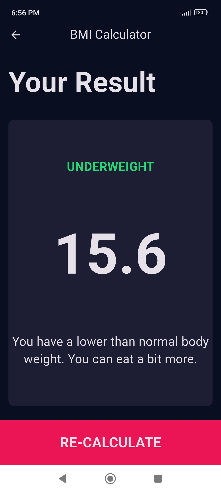

# ⚖️ BMI Calculator - Flutter App

A clean and interactive Body Mass Index calculator built with Flutter, created as part of a Flutter development course.

## 📚 About the Project

**BMI Calculator** is a health and fitness mobile app that allows users to input their gender, height, weight, and age, and receive their Body Mass Index result along with an interpretation.

## 🎯 Course Objective

This project focuses on building a **multi-screen UI** with custom widgets, reusable components, and user interaction.

## 🚀 What I Learned

By creating this app, I learned:

- 🧱 How to create and use **custom reusable widgets**
- 🧭 How to navigate between **multiple screens** using Flutter Routes and Navigator
- 🎯 How to use **GestureDetector** to capture user taps
- 🎨 How to design UI using **Slider**, **Cards**, and **Icons**
- 🔲 How to use **ThemeData** to apply consistent styling across the app
- 🧩 How to **extract and refactor widgets** with just a click
- 🧬 The difference between **composition vs. inheritance** in Flutter and how to create UI the Flutter way
- 🌈 How to use **custom color palettes** with hex codes
- 📐 Understanding **Dart Enums** and the **Ternary Operator**
- 🔒 The difference between **const** and **final** in Dart and when to use each

---

## 🖼️ App Preview

*Home screen*

*Result screen*

---

## 🛠️ Built With

- [Flutter](https://flutter.dev/)
- [Dart](https://dart.dev/)

---

## 📦 Packages

- [font_awesome_flutter](https://pub.dev/packages/font_awesome_flutter) – Used to add stylish icons throughout the app.

---
